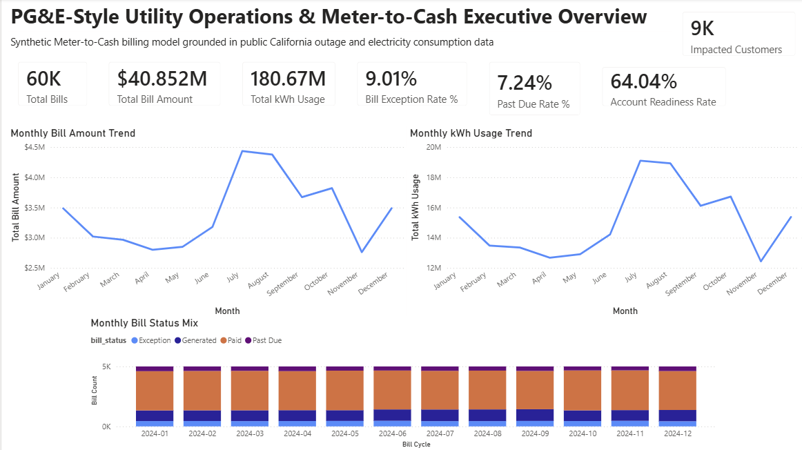
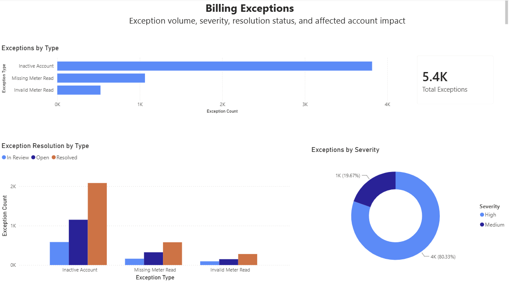
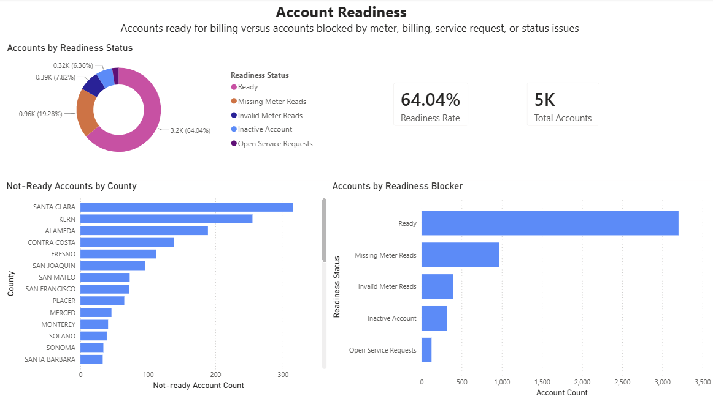
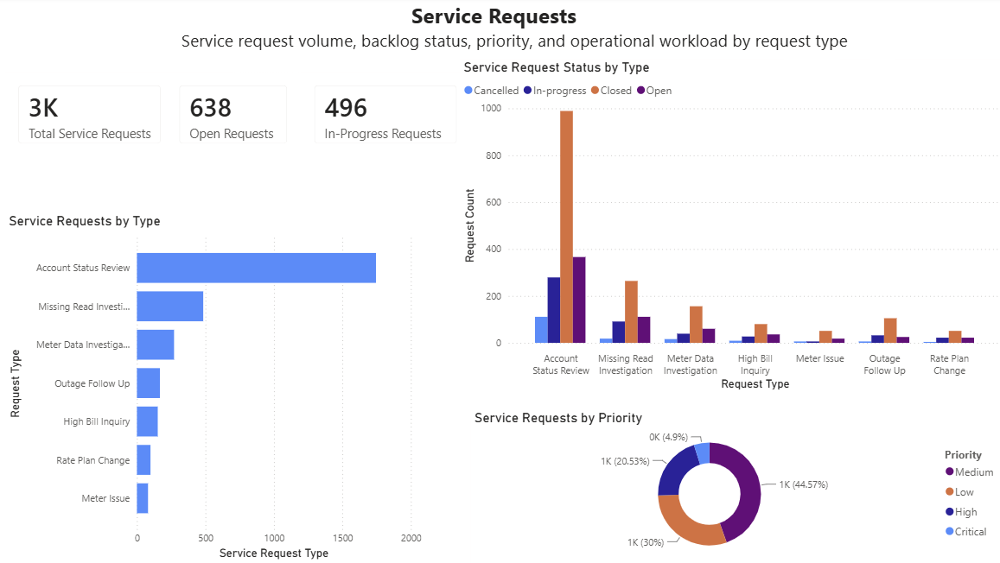
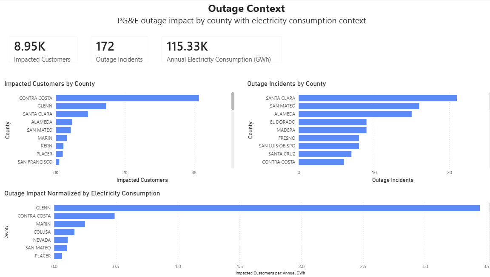

# PG&E Utility Analytics & Meter-to-Cash Operations

An end-to-end utility analytics portfolio project combining **California electricity consumption and outage data**, a **synthetic meter-to-cash operating model**, **SQL reporting**, **geospatial analysis**, **Power BI**, and **predictive exception-risk modeling**.

The project demonstrates how raw utility data can be transformed into decision-ready analytics across operational, financial, geographic, and predictive use cases.

> **Note:** This is an independent portfolio project and is not affiliated with or endorsed by Pacific Gas and Electric Company (PG&E). Public electricity and outage data are combined with clearly identified synthetic customer, meter, billing, and service-request data. No proprietary PG&E customer or operational data are used.

---

## Project Overview

The project follows a multi-stage analytics workflow:

```text
Public Utility Data
        │
        ▼
Data Cleaning & Transformation
        │
        ├── Electricity Consumption Analysis
        ├── Outage Analysis
        └── Geospatial Analysis
        │
        ▼
Synthetic Meter-to-Cash Data Model
        │
        ▼
SQLite Analytical Database
        │
        ▼
SQL Reporting Views
        │
        ├── Power BI Dashboard
        └── Predictive Exception-Risk Model
```

The analysis is organized into six sequential Jupyter notebooks covering data exploration, operational data modeling, SQL, geospatial analytics, business intelligence, and machine learning.

---

## Business Questions

The project explores questions such as:

* How does electricity consumption vary across utilities, counties, sectors, and months?
* Which PG&E service-area counties show the greatest outage customer impact?
* How does outage impact change when contextualized by county electricity demand?
* What operational issues can prevent an account from progressing cleanly through a meter-to-cash process?
* How can SQL views support recurring billing, exception, service-request, and account-readiness reporting?
* Can historical operational signals identify account-cycles at elevated risk of future billing exceptions?

---

## Data Sources

### Public Utility Data

The project uses public California electricity and outage datasets, including:

* monthly electricity consumption by **county**
* monthly electricity consumption by **utility/entity**
* outage information by **incident**
* outage summaries by **county**
* outage-area **GeoJSON** for geographic analysis

The electricity-consumption data include monthly observations by sector and provide the demand context used throughout the project.

The outage files represent an outage snapshot rather than a complete historical reliability dataset. Results derived from them should therefore be interpreted as operational context rather than formal long-term reliability metrics.

### Synthetic Operational Data

Because real customer-level utility billing data are not public, the project creates a synthetic meter-to-cash environment containing:

* customers
* service accounts
* meters
* rate plans
* meter reads
* billing cycles
* bills
* billing exceptions
* service requests
* validation tables
* UAT test cases

The synthetic data are designed to resemble realistic utility operating relationships while remaining entirely fictional.

Real 2024 electricity-consumption seasonality is incorporated into the synthetic usage-generation process so that simulated account activity reflects realistic monthly demand patterns.

---

## Analytical Pipeline

### 1. Data Inventory, Cleaning & Outage Exploration

`notebooks/01_data_inventory_and_outage_exploration.ipynb`

The first notebook inventories and cleans the public datasets.

Key transformations include:

* standardizing field names
* parsing outage timestamps
* cleaning categorical utility, sector, county, cause, and outage fields
* removing empty export columns
* creating monthly date variables
* aggregating electricity consumption
* creating PG&E-specific analytical subsets
* grouping detailed outage causes into broader categories
* joining outage impact with county electricity demand
* developing a normalized outage-impact indicator

### Selected Findings

The outage snapshot contained:

* **172 PG&E incidents**
* **8,953 impacted PG&E customers**

Important patterns included:

* Contra Costa County had the largest absolute customer impact.
* Santa Clara County had relatively high incident volume but lower impact per incident.
* Glenn County had comparatively few incidents but disproportionately high customer impact.
* One Contra Costa incident affected more than 4,000 customers, illustrating the skewed distribution of outage impact.
* Unknown or unreported causes represented a meaningful portion of impacted customers, highlighting a data-quality limitation.

After contextualizing customer impact by county electricity consumption, smaller-demand counties moved higher in the rankings. Glenn County showed the highest normalized impact in the analysis.

This normalized measure is intended as contextual analysis rather than a formal utility reliability statistic.

---

## Electricity Consumption Analysis

The California Energy Commission data provide the demand-side context for the project.

For 2024, the analysis found that:

* PG&E was one of California's largest electricity-serving entities by annual consumption.
* Commercial and residential demand represented the largest PG&E consumption sectors.
* Electricity demand showed clear seasonal variation.
* July and August were among the highest-demand months.
* Spring and late fall contained lower-demand periods.
* Non-residential consumption exceeded residential consumption throughout the year.

These observed seasonal patterns are subsequently used when generating the synthetic meter-to-cash data.

---

## Synthetic Meter-to-Cash Data Model

`notebooks/02_meter_to_cash_data_model_design.ipynb`

The second notebook creates a synthetic relational utility operating environment.

The generated system contains approximately:

* **5,000 customers**
* **5,000 service accounts**
* **5,000 meters**
* **60,000 monthly meter reads**
* **60,000 bills**
* associated billing exceptions and service requests

The model simulates operational conditions such as:

* valid meter reads
* estimated reads
* missing reads
* invalid readings
* inactive accounts
* billing exceptions
* high-bill inquiries
* meter investigations
* outage-related follow-up
* rate-plan changes

Relationship-validation checks are included to test referential integrity across the synthetic system.

---

## SQL Analytics Layer

`notebooks/03_sql_database_and_analysis_views.ipynb`

The cleaned and synthetic datasets are loaded into a SQLite database:

```text
data/database/pge_meter_to_cash.db
```

Reusable SQL reporting views include:

```text
vw_meter_to_cash_monthly_kpis
vw_billing_exception_summary
vw_bill_status_summary
vw_service_request_backlog
vw_account_readiness
vw_monthly_billing_trend
vw_pge_outage_consumption_context
```

These views form the reporting layer used for downstream business intelligence.

### Account Readiness

The account-readiness analysis classified approximately **64% of accounts as ready**, while the remaining accounts were affected by operational issues such as:

* missing meter reads
* invalid readings
* inactive account status
* open service requests

This layer demonstrates how operational data can be translated into actionable exception and readiness reporting.

---

## Geospatial Outage Analysis

`notebooks/04_geospatial_outage_mapping.ipynb`

The geospatial workflow cleans and analyzes PG&E outage-area polygons.

The cleaned GeoJSON contains approximately:

* **173 outage-area polygons**
* coverage across **33 counties**

The analysis incorporates:

* county
* outage type
* outage cause
* impacted customers
* incident identifiers
* timestamps
* estimated restoration duration
* polygon geometry

Polygon counts are intentionally distinguished from incident counts because a mapped outage area and an outage incident represent different analytical units.

---

## Power BI Dashboard

`notebooks/05_powerbi_dashboard_preparation.ipynb`

The reporting layer feeds an interactive Power BI dashboard covering utility operating performance.

Dashboard pages include:

1. Executive Overview
2. Billing Performance
3. Billing Exceptions
4. Service Request Backlog
5. Account Readiness
6. PG&E Outage Context

The Power BI file is available at:

```text
powerbi/pge_meter_to_cash_dashboard.pbix
```

### Dashboard Preview

#### Executive Overview



#### Billing Exceptions



#### Account Readiness



#### Service Requests



#### Outage Context



---

## Predictive Billing-Exception Risk

`notebooks/06_predictive_exception_risk_model.ipynb`

The final notebook develops a predictive model to identify account-cycles at elevated risk of generating a billing exception.

The modeling dataset contains approximately:

* **60,000 account-cycle observations**
* an exception rate of roughly **9%**

An initial modeling approach identified variables that directly revealed the outcome. Those variables were recognized as target leakage and excluded from the final predictive design.

Two leakage-aware models were evaluated:

* Logistic Regression
* Random Forest

### Selected Random Forest Performance

Approximate test-set performance:

| Metric    | Score |
| --------- | ----: |
| Accuracy  | 0.905 |
| Precision | 0.479 |
| Recall    | 0.590 |
| F1 Score  | 0.529 |
| ROC-AUC   | 0.818 |

Historical service-request activity emerged as an important predictive signal.

### Risk Segmentation

Predicted probabilities were converted into operational risk bands.

| Risk Band | Actual Exception Rate |
| --------- | --------------------: |
| High      |                 37.6% |
| Medium    |                 5.65% |
| Low       |                 2.77% |

The high-risk segment experienced approximately **13.6×** the exception rate of the low-risk segment.

This demonstrates how predictive analytics could support prioritized operational review rather than treating every account-cycle equally.

---

## Repository Structure

```text
pge-utility-analytics/
│
├── data/
│   ├── database/
│   ├── geospatial/
│   ├── ml/
│   ├── powerbi/
│   ├── processed/
│   ├── reporting/
│   └── synthetic/
│
├── notebooks/
│   ├── 01_data_inventory_and_outage_exploration.ipynb
│   ├── 02_meter_to_cash_data_model_design.ipynb
│   ├── 03_sql_database_and_analysis_views.ipynb
│   ├── 04_geospatial_outage_mapping.ipynb
│   ├── 05_powerbi_dashboard_preparation.ipynb
│   └── 06_predictive_exception_risk_model.ipynb
│
├── powerbi/
│   └── pge_meter_to_cash_dashboard.pbix
│
├── raw/
│
├── screenshots/
│
├── .gitignore
├── requirements.txt
└── README.md
```

---

## Technologies

**Languages & Analysis**

* Python
* SQL
* DAX

**Python Ecosystem**

* pandas
* NumPy
* Matplotlib
* scikit-learn

**Data & Analytics**

* SQLite
* GeoJSON
* Microsoft Excel
* Power BI

**Methods**

* data cleaning and validation
* exploratory data analysis
* relational data modeling
* SQL analytics
* KPI development
* geospatial analysis
* business intelligence
* classification modeling
* feature importance
* risk segmentation
* target-leakage detection

---

## Reproducing the Analysis

Clone the repository:

```bash
git clone https://github.com/cvanniek/pge-utility-analytics.git
cd pge-utility-analytics
```

Install the required Python packages:

```bash
pip install -r requirements.txt
```

Run the notebooks sequentially:

```text
01 → 02 → 03 → 04 → 05 → 06
```

The notebooks are intentionally numbered because later stages build on outputs created earlier in the pipeline.

---

## Portfolio Focus

This project demonstrates a combination of skills relevant to:

* Data Analyst
* Data Scientist
* Business Intelligence Analyst
* Applied Economics / Economic Analytics
* Utility Analytics
* Operations Analytics

The emphasis is on connecting technical analysis to operational decision-making rather than treating data engineering, visualization, and machine learning as isolated exercises.

---

## Author

**Chris van Niekerk**

M.S. Data Science, University of Virginia
B.S. Actuarial Science
B.S. Data Analytics & Statistics

[GitHub](https://github.com/cvanniek)
